# ÔN TẬP KIẾN THỨC KHÓA PRE - IELTS

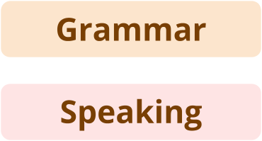

> Dùng mục lục (outline) để xem phần mình cần ôn.
> Ôn thi thật tốt nhé \(^o^)/

---

## PART 1: PART OF SPEECH (LOẠI TỪ)

### Mindmap tổng hợp các loại từ được học trong khóa

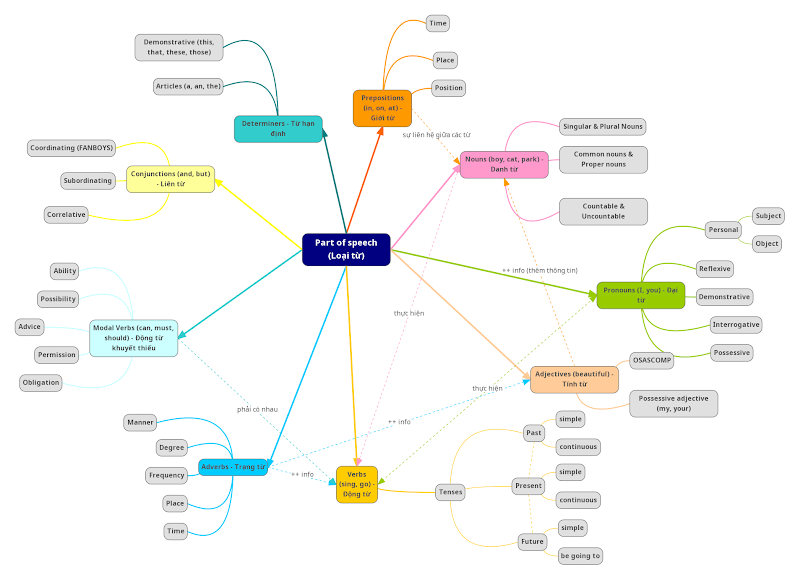

**Mục tiêu ôn tập:** Nhận biết được các loại từ trong câu, chức năng, vị trí và vai trò trong câu.

**Ví dụ:** She always bakes a cake at home on Saturday, and she may make a delicious Tiramisu for you today.

| P. | Adv. | Modal | V. | Det. | Adj | N. | Prep. | Conj. |
|---|---|---|---|---|---|---|---|---|
| She (subject), you (object) | always, today | may | bakes, make | a | delicious | cake, home, Saturday, Tiramisu | at, on, for | and |

Now, let's take a closer look! (Cùng ôn tập lại kĩ hơn về các loại từ)

---

### 1.1 NOUN (DANH TỪ) - Lesson 7 + 8

**Definition:** words for people, animals, places or things (Từ chỉ người, sự vật, sự việc)

| | |
|---|---|
| **Common nouns** | **Proper nouns** |
| Boy, girl, cat, office | Long, Hoa, Kitty, LangGo |

| **Singular nouns** | **Plural nouns** |
|---|---|
| A + consonant → A student | 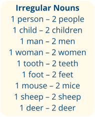 |
| An + vowel → An elephant | Most of the nouns → Students |
| | "O, s, ss, ch, x, sh, z" → Peaches |
| | f/fe (knife) → knives |
| | Vowel + 'y' (toy) → toys |
| | Consonant + 'y' → babies |
| | Always plural (a pair of) → sneakers, shorts, glasses, etc. |

| **Countable nouns** | **Uncountable nouns** |
|---|---|
|  |  some rice |
| A dog - two dogs |  some water |
| ★ Dùng được với số đếm | ★ Không dùng được với số đếm |
| ★ Có dạng số ít và số nhiều | ★ Luôn đi với động từ chia số ít |
| | ★ Đặc điểm phổ biến của danh từ không đếm được: |
| | - Không có hình dạng nhất định: Smoke, air, water |
| | - Quá nhỏ và không thể đếm: Rice, sugar, salt |
| | - Khái niệm trừu tượng: Beauty, fear, knowledge, hope |

---

### 1.2 QUANTIFIERS (LƯỢNG TỪ) - Lesson 8

**Definition:** words expressing the quantity of the object (Từ chỉ lượng); usually goes before a noun (thường đứng trước danh từ)

| | Countable singular | Countable plural | Uncountable |
|---|---|---|---|
| **(+)** | A - an | Some, a few, few, many, a lot of | Some, a little, little, any, a lot of |
| **(-)** | A - an | many, any | much, any |
| **(?)** | A - an | How many, any, a lot of, some (in questions usually expecting the answer 'yes', invitations/suggestions) | How much, any, a lot of, some (in questions usually expecting the answer 'yes', invitations/suggestions) |

---

### 1.3 PRONOUNS (ĐẠI TỪ) - Lesson 9

**Definition:** A pronoun is a word that takes the place of a common noun or a proper noun.

#### 1.3.1 Personal pronouns (Đại từ nhân xưng)

| | Subject pronouns | Object pronouns |
|---|---|---|
| | (They take the place of nouns and are used as the subject of the verb in a sentence) | (They take the place of nouns and are used as the object of the verb in a sentence) |
| First person singular | I | me |
| Second person singular | You | you |
| Third person singular | He / She / It | Him / her / it |
| First person plural | We | us |
| Second person plural | You | You |
| Third person plural | They | them |

#### 1.3.2 Reflexive pronouns (Đại từ phản thân - bản thân tự làm)

E.g: I made this cake myself

The words myself, yourself, himself, herself, itself, ourselves, yourselves and themselves are called reflexive pronouns.

**Ví dụ tổng hợp:**

| Subject pronouns | Object pronouns | Possessive adjectives (tính từ sở hữu) | Possessive pronouns (đại từ sở hữu) | Reflexive pronouns |
|---|---|---|---|---|
| Ngôi thứ nhất: **I** — I have a house | **Me** — Phuong gave me a house | **My** — This house is my friend's gift | **Mine** — This house is mine (= my house). | **Myself** — I don't buy this house myself. |
| Ngôi thứ nhất số nhiều: **we** | Ngôi thứ nhất số nhiều: **us** | Ngôi thứ nhất số nhiều: **our** | Ngôi thứ nhất số nhiều: **ours** | Ngôi thứ nhất số nhiều: **Ourselves** |
| Ngôi thứ 2 số ít/nhiều: **you** | Ngôi thứ 2 số ít/nhiều: **you** | Ngôi thứ 2 số ít/nhiều: **your** | Ngôi thứ 2 số ít/nhiều: **yours** | Ngôi thứ 2 số ít/nhiều: **yourself / yourselves** |
| Ngôi thứ 3 số ít: **He, she, it** | Ngôi thứ 3 số ít: **him, her, it** | Ngôi thứ 3 số ít: **his, her, its** | Ngôi thứ 3 số ít: **his, hers, its*** | Ngôi thứ 3 số ít: **himself, herself, itself** |
| Ngôi thứ 3 số nhiều: **they** | Ngôi thứ 3 số nhiều: **them** | Ngôi thứ 3 số nhiều: **their** | Ngôi thứ 3 số nhiều: **theirs** | Ngôi thứ 3 số nhiều: **themselves** |

*possessive pronoun "its" không nên dùng trừ khi đi với own, e.g: It had a life of its own

#### 1.3.3 Demonstrative pronouns (Đại từ chỉ định)

| | NEAR | FAR |
|---|---|---|
| **SINGULAR** | 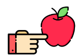 This is an apple. | 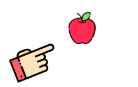 That is an apple. |
| **PLURAL** | 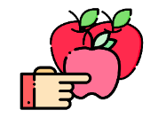 These are apples. | 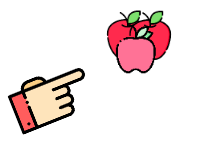 Those are apples. |

#### 1.3.4 Interrogative pronouns (Đại từ nghi vấn)

Những từ who, whom, whose, what và which được gọi là các đại từ nghi vấn. Những từ này dùng để đặt câu hỏi.

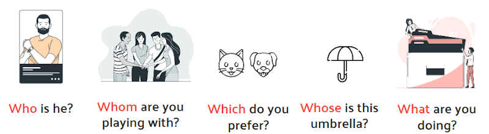

---

### 1.4 ADJECTIVES (TÍNH TỪ) - Lesson 10

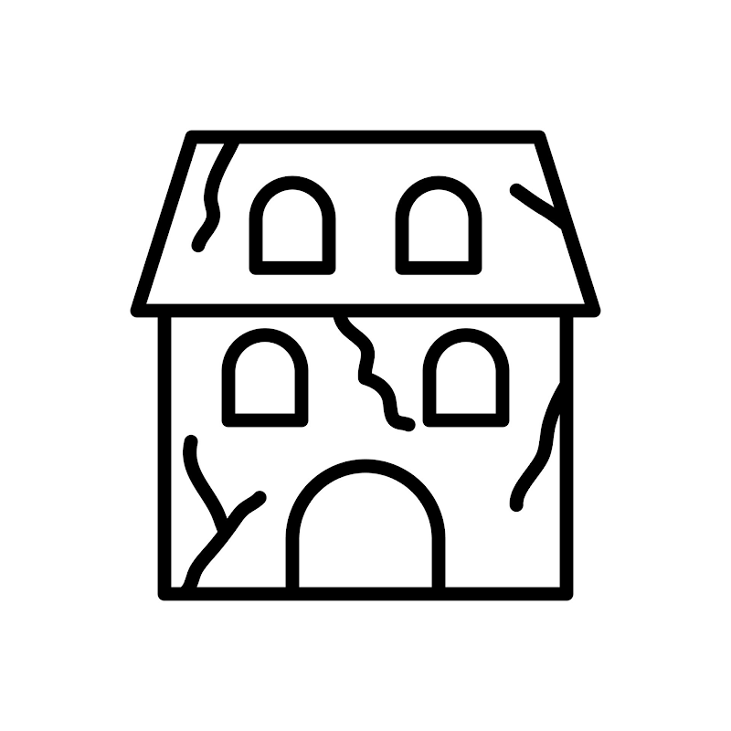

**Definition:** Tính từ là những từ miêu tả, bổ sung thêm ý nghĩa cho danh từ.

#### ★ Position

| Vị trí | Ví dụ |
|---|---|
| Trước một danh từ | E.g: She's an impatient person. |
| Sau động từ "to be" | E.g: Today is wonderful. |
| Sau động từ chỉ tri giác | E.g: I feel great today. |

#### ★ Descriptive adjectives

| Opinion | Size | Age | Shape | Color | Origin | Material | Purpose |
|---|---|---|---|---|---|---|---|
| Nice, Ugly, Cheap, Expensive, Good, Bad, Stupid, Smart, Amazing | Big, Huge, Small, Large, Narrow, Tall, Short, Medium | New, Old, Second-hand, Ancient | Square, Round, Triangular, Rectangular, Flat | Red, Black, White, Yellow | American, English, Spanish, Japanese | Leather, Cotton, Silk, Wooden, Plastic, Metal, Silver, Gold, Paper | Shopping, Sleeping, Touring, Racing |

E.g: My mother has short black hair.

#### ★ Word formation: Some common prefix - suffix (tiền tố - hậu tố)

- Tiền tố là một phần thêm vào đầu từ khiến thay đổi ý nghĩa của từ đó.
- Hậu tố là một phần thêm vào cuối từ khiến thay đổi ý nghĩa của từ đó.

| Prefix | Example | Suffix | Example |
|---|---|---|---|
| bi- (two) | bilingual | -able, -ible (able to be done, capable of) | Readable, knowledgeable |
| co- (together) | codependent | -al (relating to) | National, seasonal |
| dis- (not/reverses the meaning) | disloyal | -ful (Having the characteristic of) | joyful, wonderful |
| non- (not/reverses the meaning) | non-academic | -ian (relating to nationalities) | Australian, Indian |
| im-, in-, ir-, il- (not/reverses the meaning) | Impossible, illegal | -ive (something that is) | Attractive, productive |
| un- (not/reverses the meaning) | unfriendly | -less (without) | Homeless, Useless |
| over- (too much) | overtired | -like (resembling) | Childlike |
| pre- (before) | precooked | -ous (having the characteristic) | Delicious, famous |

#### ★ NOTE: Adjectives ending in '-ed' and '-ing'

| -ed adjectives | -ing adjectives |
|---|---|
| Adjectives that end in -ed generally describe emotions – they tell us how people feel. (Tính từ đuôi -ed thường miêu tả cảm xúc, thể hiện cảm nhận) | Adjectives that end in -ing generally describe the thing that causes the emotion (Tính từ đuôi -ing thường miêu tả tính chất sự vật, sự việc, người - thứ gây ra cảm xúc đó) |
| E.g: She is interested in English. | E.g: She thinks English is interesting. |
| | He is so boring (~he makes me feel bored) |
| | The shocking news made me feel shocked. |

---

### 1.4 DETERMINERS (TỪ HẠN ĐỊNH) - Lesson 11

**Definition:** Một từ đứng trước một danh từ hoặc cụm danh từ để xác định một người, sự vật, sự việc cụ thể đang được đề cập đến.

E.g: In the phrases "my first boyfriend" and "that strange woman", the words "my" and "that" are determiners.

#### 1.4.1 Articles (Mạo từ)

| A / An | The |
|---|---|
| Các từ "a" và "an" được gọi là mạo từ không xác định. A / an + Singular Nouns. E.g: She eats an apple a day. | Từ "the" được gọi là mạo từ xác định. The + Singular/Plural Nouns / Uncountable Nouns. E.g: She eats 10 apples a day. The apples which she eats every day are from NewZealand |
| ♥ Used for objects that are not specific or one of several things of a similar type — I need a phone. | ♥ Used for specific objects or objects that both the speaker and listener know — Can you give me the books on the table? |
| ♥ Used the first time we introduce an object — I saw a movie last night. | ♥ Used when we mention the object again — The movie is based on a real-life incident. |
| ♥ Used as synonyms for the number 'one' — They bought a computer. | ♥ Used before countries or other regions with plural names ('s' at the end) and bodies of water — The Netherlands |
| | ♥ Used before certain adjectives to give a plural meaning — The old need our help. |
| | ♥ Những cách dùng khác: [HO Grammar_The.docx](https://docs.google.com/document/d/1Zz1NbZY81SDHwZk3sPbwwFNSkDHO235Y/edit) |

**We don't use an article:**

- ♥ before plural countable nouns and uncountable nouns when we mean 'in general' — I like cats. Doctors have to study for a long time.
- ♥ before abstract nouns — What is the difference between jealousy and envy?
- ♥ before names of meals, languages, sports, and many expressions of place and time — I never drink before breakfast. I'll see you next week. He stayed at home because he was ill. Do you play tennis?

#### 1.4.2 Possessive determiners (Từ hạn định sở hữu)

Từ hạn định sở hữu / Tính từ sở hữu: **my, your, his, her, its, our, their**.

Sử dụng trước danh từ thể hiện cái gì thuộc về ai/cái gì.

#### 1.4.3 Demonstrative determiners (Từ hạn định chỉ định)

| | NEAR | FAR |
|---|---|---|
| **SINGULAR** |  This apple is red. |  That apple is small. |
| **PLURAL** |  These apples are cheap. |  Those apples are expensive. |

---

### 1.5 PREPOSITIONS (GIỚI TỪ) - Lesson 12

**Khái niệm:** Giới từ là những từ dùng để diễn tả mối quan hệ của cụm từ đứng phía sau nó với các thành phần khác trong câu. Giới từ thường chỉ vị trí, địa điểm và thời gian.

**Vị trí:** Thường được theo sau bởi danh từ hoặc đại từ (Prep + N/Pro)

#### ★ Common prepositions - position (những giới từ phổ biến - chỉ vị trí)

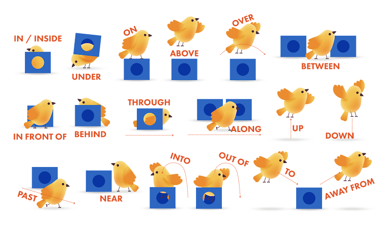

*Một số từ khác:*
- In the middle of (sth)
- In the corner (of sth)
- On the left / right of …
- Across from / opposite…
- Against the wall

#### ★ IN, ON, AT (giới từ phổ biến, chỉ địa điểm, thời gian)

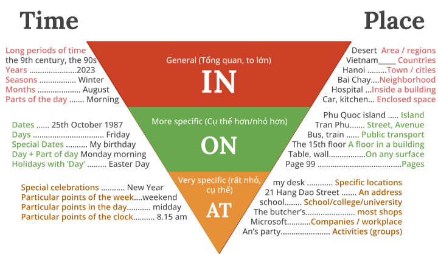

*Note: Không sử dụng giới từ với tomorrow, yesterday, tomorrow morning, yesterday evening.*

E.g: We're flying to Washington tomorrow afternoon.

---

### 1.6 VERBS (ĐỘNG TỪ) - Lesson 13

 I can read

 I can sing

**Khái niệm:** Động từ phần lớn là các từ chỉ hành động (action words), cho biết người, con vật, đồ vật đang có hoạt động gì.

*Note:*
- Các động từ phổ biến: Have, Go, Do, Make, Come, Take, Bring, Get
- Có 12 thì động từ, biến đổi theo Quá khứ (past), Hiện tại (Present), Tương lai (Future)

---

### 1.7 ADVERBS (TRẠNG TỪ) - Lesson 17

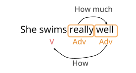

**Khái niệm:** Trạng từ thường cung cấp thêm thông tin cho động từ, tính từ hoặc trạng từ.

#### Các loại trạng từ

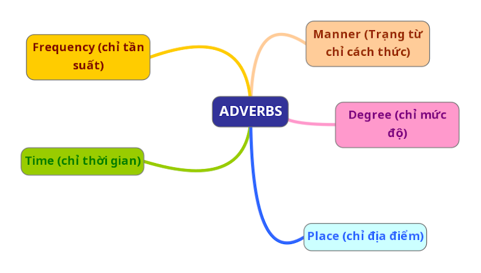

*Ngoài 5 loại phổ biến, còn nhiều loại trạng từ khác*

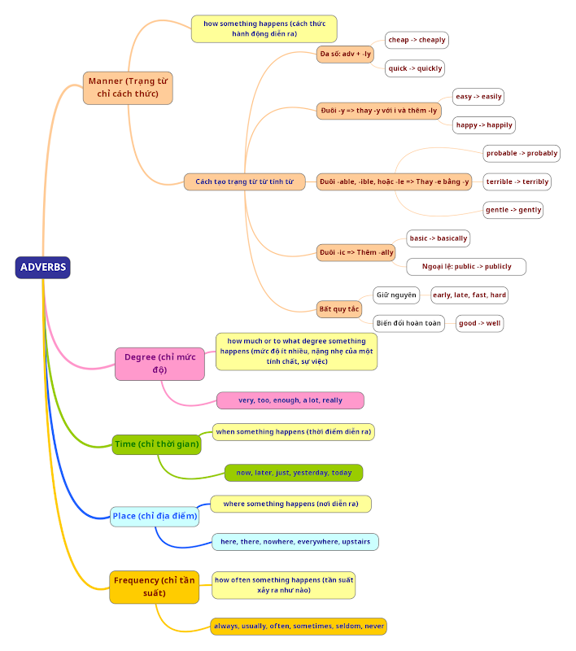

**Note: Vị trí trạng từ**
- **Front position:** đứng đầu câu/vế câu
- **Mid Position:** đứng giữa chủ ngữ và động từ chính.
  - Trường hợp có trợ động từ (have/has) hoặc động từ khuyết thiếu (can, might…): đứng giữa trợ động từ/động từ khuyết thiếu và động từ chính.
  - Đứng sau động từ to be
- **End Position:** đứng cuối câu/vế câu.

*Common (phổ biến) ⭐⭐⭐; Not common (không phổ biến) ⭐*

| | | |
|---|---|---|
| 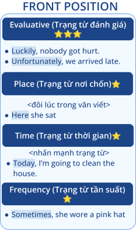 | 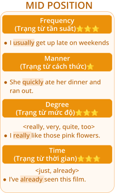 | 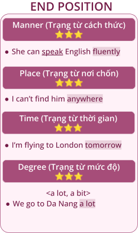 |

---

### 1.8 CONJUNCTION (LIÊN TỪ) - Lesson 18

**Khái niệm:** Liên từ là từ kết nối hai từ, hai cụm từ, hai vế câu và thể hiện mối quan hệ giữa chúng.

E.g: He is nice and tall. In his free time, he can play soccer with friends or read books at home. He likes to learn new things, so he takes some online courses.

#### Các loại liên từ

- Liên từ kết hợp (coordinating conjunctions)
- Liên từ tương quan (correlative conjunctions)
- Liên từ phụ thuộc (subordinating conjunctions) (*học sau)

| Liên từ kết hợp | Liên từ tương quan |
|---|---|
| Các từ dùng để nối các từ, cụm từ cùng loại hoặc những mệnh đề ngang hàng nhau. Ví dụ: Nối tính từ với tính từ, danh từ với danh từ… | Những cặp từ dùng để liên kết hai từ, cụm từ tương đương nhau về chức năng ngữ pháp trong câu. Sử dụng với mục đích nhấn mạnh, nhằm hướng sự chú ý của người đọc đến hai thành phần được liên kết. |
| 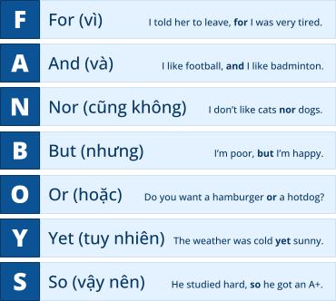 | **Both…and…** (vừa…vừa/cả…và…) — E.g: This house is both large and warm. |
| | **Either…or…** (hoặc…hoặc…) — E.g: You should put it either on the left or on the right. |
| | **Neither…nor…** (cả…cũng không…) — E.g: He is neither rich nor famous. |
| | **Not only…but also…** (không những…mà còn) — E.g: My father is not only friendly but also kind. |
| | **would rather…than…** (muốn/thích…hơn là…) — E.g: She'd rather play the piano than sing. |

---

## PART 2: TENSES

6 thì, cấu trúc (hiện tại đơn/tiếp diễn, quá khứ đơn/tiếp diễn, tương lai đơn, be going to)

| QUÁ KHỨ TIẾP DIỄN | HIỆN TẠI TIẾP DIỄN | BE GOING TO |
|---|---|---|
| [Lesson 14.pptx](https://docs.google.com/presentation/d/1ngclkMB_8uM5OucFOC_lzi_v-6uCXUt0/edit#slide=id.p14) | [Lesson 13.pptx](https://docs.google.com/presentation/d/13-lg35boZ7TUcsyMCMt7gCoxX4bwdlj9/edit?usp=sharing&ouid=102921648151980889953&rtpof=true&sd=true) | [Lesson 15.pptx](https://docs.google.com/presentation/d/1E8CG9vXFgmRFEyGvqoelPDkk5GCdTOmQ/edit#slide=id.p23) |
| Dấu hiệu nhận biết: last… / …ago / yesterday | Dấu hiệu nhận biết: now, at the moment, today, this week | Dấu hiệu nhận biết: tomorrow / next (week) / soon / tonight |
| Cách dùng: | Cách dùng: | Cách dùng: |
| + Hành động đã xảy ra trong quá khứ | + Hành động đang diễn ra tại thời điểm nói / quanh thời điểm nói | + Dự đoán dựa trên dấu hiệu ở hiện tại |
| + Chuỗi hành động đã diễn ra trong quá khứ | + Tình huống tạm thời | + Sự kiện tương lai có ý định trước, kế hoạch (ít cụ thể, chắc chắn hơn HTTD) |
| + Thói quen quá khứ | + Sự kiện tương lai | |
| | + Thói quen xấu (be + always) | |

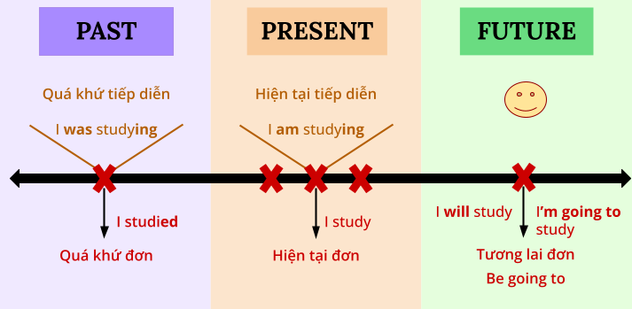

| QUÁ KHỨ ĐƠN | HIỆN TẠI ĐƠN | TƯƠNG LAI ĐƠN (WILL) |
|---|---|---|
| Dấu hiệu nhận biết: while / when / at that moment / at 7 pm | Dấu hiệu nhận biết: every (day) / Each (month) / Once a week / three times a month. Always, usually, often, etc. | Dấu hiệu nhận biết: tomorrow / next (week) / soon / tonight |
| Cách dùng: | Cách dùng: | Cách dùng: |
| + Các hành động song song | + Sự thật hiển nhiên | + Dự đoán dựa trên quan điểm, trải nghiệm cá nhân |
| + Hành động tại thời điểm cụ thể | + Thói quen | + Sự kiện tương lai chưa có kế hoạch |
| + Hành động đang diễn ra thì hành động khác xen vào | + Thời gian biểu | + Quyết định ngay lúc nói |

### Công thức các thì

| QUÁ KHỨ TIẾP DIỄN | HIỆN TẠI TIẾP DIỄN | BE GOING TO |
|---|---|---|
| (+) S + was/were + V-ing | (+) S + am/is/are + V-ing | (+) S + am/is/are going to + V0 |
| (-) S + was/were + not + V-ing | (-) S + am/is/are + not + V-ing | (-) S + am/is/are + not + going to + V0 |
| (?) Was/Were + S + V-ing? | (?) Am/Is/Are + S + V-ing? | (?) Am/Is/Are + S + going to + V0? |

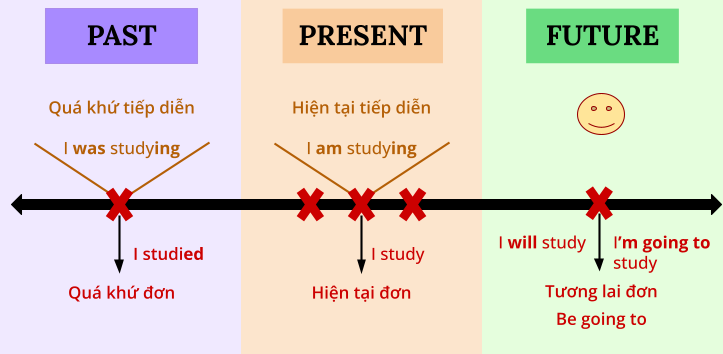

| QUÁ KHỨ ĐƠN | HIỆN TẠI ĐƠN | TƯƠNG LAI ĐƠN (WILL) |
|---|---|---|
| (+) S + was/were + N/adj | (+) S + am/is/are + N/adj | (+) S + will + V0 |
| (+) S + V2 (-ed / bất quy tắc) | (+) S + V1 (s/es/V0) | (-) S + will + not + V0 |
| (-) S + was/were + not + N/adj | (-) S + am/is/are + not + N/adj | (?) Will + S + V0? |
| (-) S + did + not + V0 | (-) S + do/does + not + V0 | |
| (?) Was/Were + S + N/adj? | (?) Am/Is/Are + S + N/adj? | |
| (?) Did + S + V0? | (?) Do/Does + S + V0? | |

---

## PART 3: SENTENCES

**Khái niệm:** Câu là một đơn vị ngữ pháp gồm một hay nhiều từ có liên kết ngữ pháp với nhau, có ý nghĩa. Một câu cần viết hoa chữ cái đầu câu và kết câu bằng dấu chấm.

### 3.1 Thành phần câu

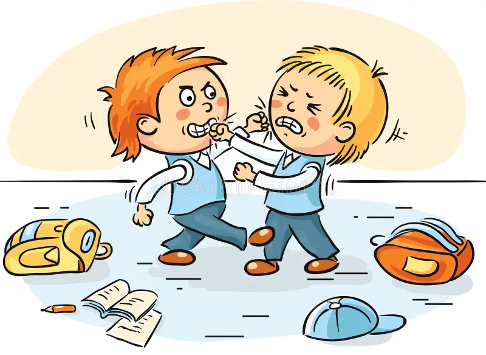

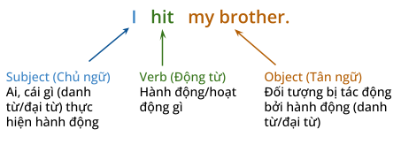

#### ⭐ Direct & Indirect objects

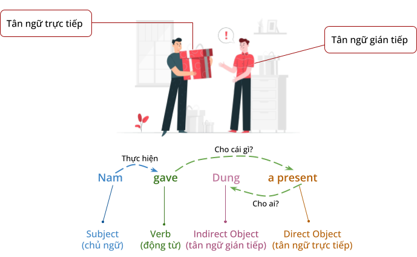

**Vị trí:** tân ngữ gián tiếp thường đứng trước tân ngữ trực tiếp hoặc đứng sau giới từ (VD: Nam gave a present to Dung)

### 3.2 Các kiểu câu

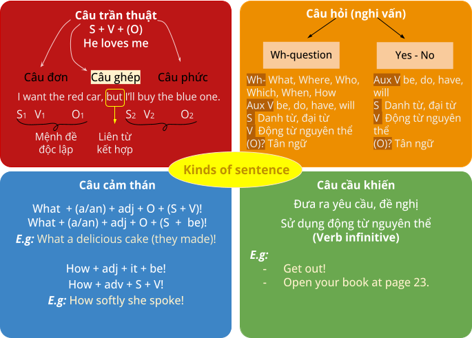

---

## Tổng hợp Suggested Vocab

59 câu tập phản xạ (audio): [Phản xạ](https://drive.google.com/drive/folders/1VtYMI5ewli-4U7wLLCyV6QuitkNpKdS5)

| Chủ đề | Tài liệu |
|---|---|
| Work and study | [Lesson 7 - Job.docx](https://docs.google.com/document/d/1ioFU4DloOvqJGWI0oIHgY7Q7D0G24Q05/edit) |
| Appearance | [Lesson 8 - Appearance.docx](https://docs.google.com/document/d/1dV_0DcDLS3aE23nvlFdHQbQC1v3je2G-/edit) |
| Family | [Lesson 9 - Family.docx](https://docs.google.com/document/d/1HuGcmO_8Nfw57MBzRkc_1vTENH7kSGsf/edit) |
| Personality | [Lesson 10 - Personality.docx](https://docs.google.com/document/d/1H2njd08jaXZU-oYTYz3KIu98bjJezc7r/edit) |
| Free time - Hobbies | [Lesson 13 - Weekend.docx](https://docs.google.com/document/d/1mw4A-3sZcb35QHa0m47MCvEYv5WE2GKJ/edit) |
| Traveling | [Lesson 14 - Trip.docx](https://docs.google.com/document/d/1AfoxLT-rloDwnGqUfE9TMDp9gT9iRFA8/edit) |
| Restaurants | [Lesson 16 - Restaurants.docx](https://docs.google.com/document/d/1Y2Y3IPl945sFOaOZvIWDXw1Wpj4Jf4Zq/edit) |
| Hometown | [Lesson 18 - Hometown.docx](https://docs.google.com/document/d/1VTk9M7SNDcF3B0mc9SU1a47xvuG6mn_l/edit) |
| Health | [Lesson 19 - Health.docx](https://docs.google.com/document/d/1h7nRX8K4bgqdczWbe-ToJ3trXzYnzDRo/edit) |
